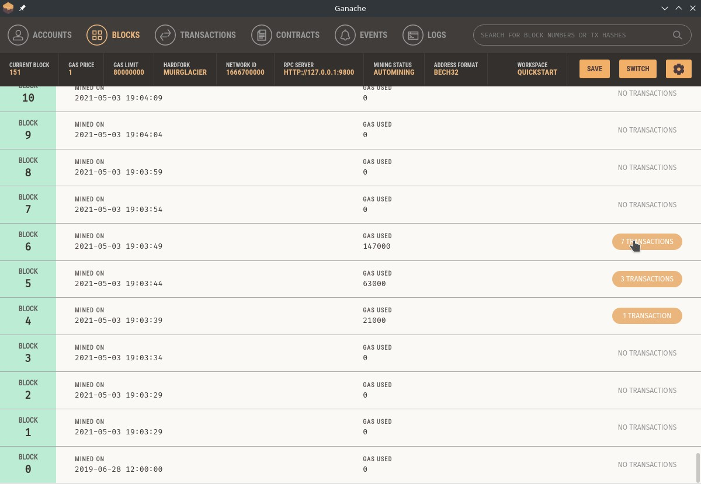
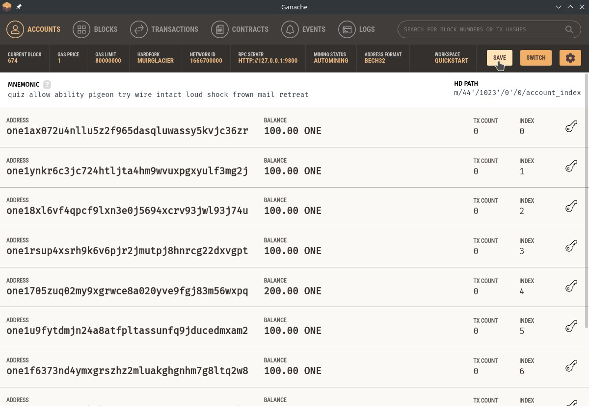
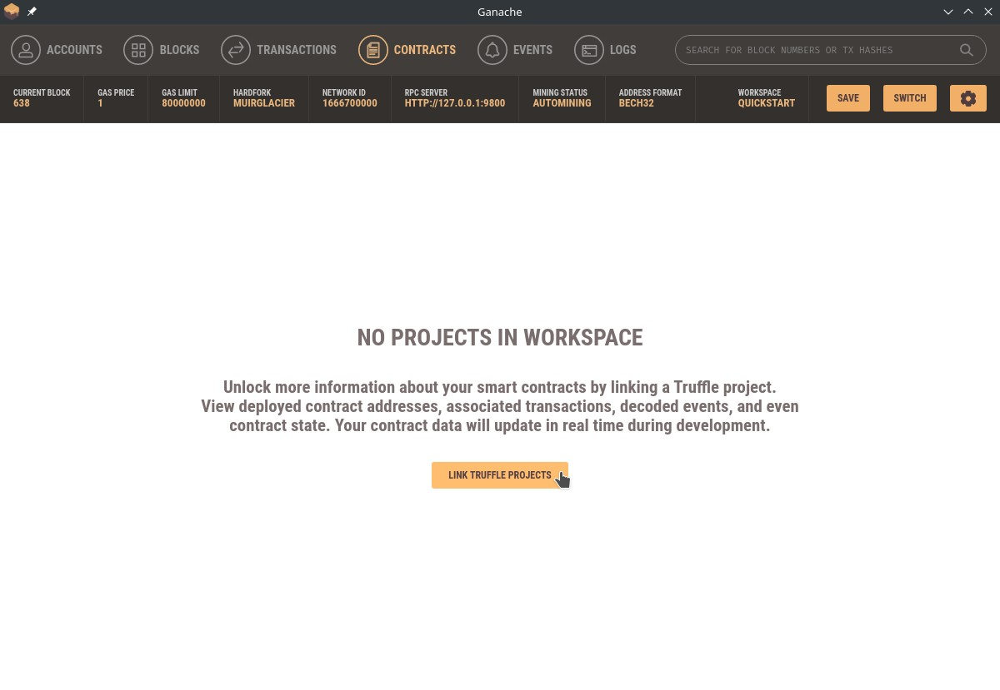
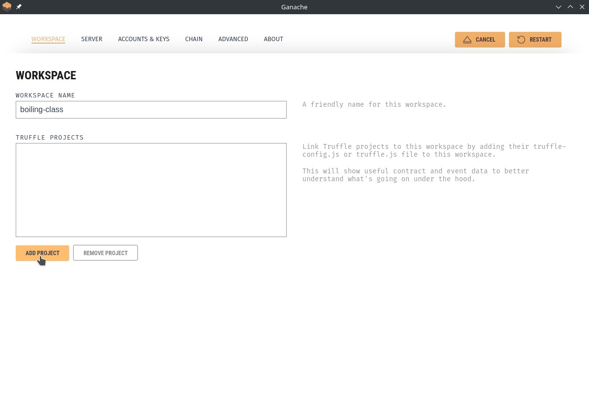
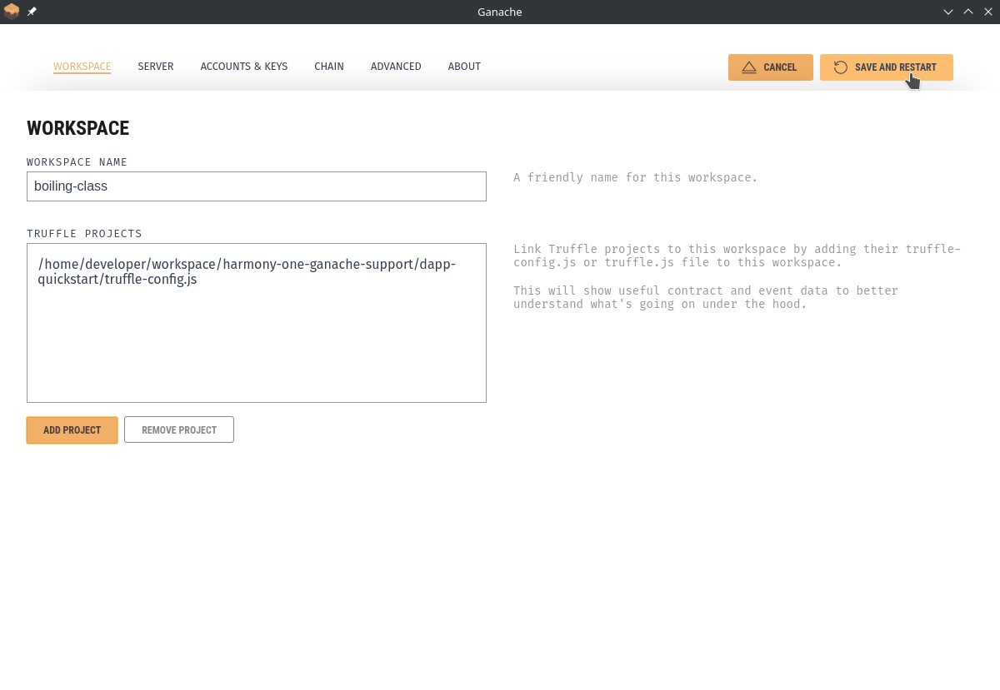
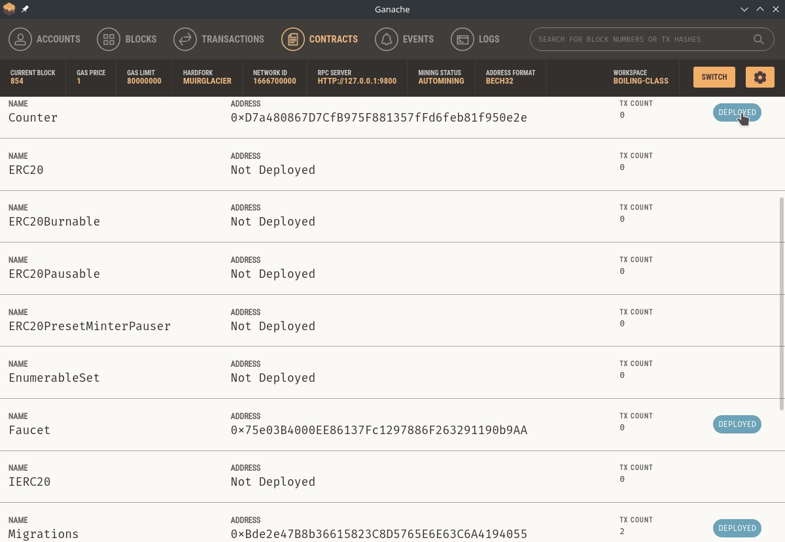

# harmony-one-ganache-support
Integrates Ganache and Harmony in a seamless setup.

With this setup you will be up and running very quickly with a Harmony One localnet deployment with full Ganache integration, a preconfigured set of accounts for testing and an example dApp.

## This repository includes
* An open repo to fork Ganache with prebuilt Harmony blockchain support, included as a submodule and accesible at https://github.com/GabrielNicolasAvellaneda/ganache/tree/harmony-integration
* Documents how to use Ganache for Harmony during the dApp development
* A simple working example of a dApp to use Ganache for Harmony
* A prebuilt Harmony blockchain image on Ganache with a set of already funded accounts
* A [demo video](./docs/demo-ganache-harmony.mp4) posted to the public on how to use Ganache with Harmony localnet

## Directory layout
```
.
├── dapp-quickstart    # An already configured Harmony One dApp for the localnet
├── docker             # Docker container related files for the Ganache Harmony One localnet
├── Dockerfile.ganache
├── ganache-harmony    # A forked Ganche which adds full Harmony One support
├── LICENSE
├── README.md
└── scripts           # Build scripts

```

## Prerequisites
* Docker 20.10+
* node 12+
* yarn
> NOTE: Tested on Manjaro Linux 21.0.2

## Setup
> **Please NOTE** that you will need to clone with `--recursive` **to get all the required dependencies!**

```
git clone --recursive https://github.com/GabrielNicolasAvellaneda/harmony-one-ganache-support
cd harmony-one-ganache-support
```

## Getting started

You can download a self-contained prebuilt Ganache with Harmony One support binary for your platform of choice from this repository's [releases](https://github.com/GabrielNicolasAvellaneda/harmony-one-ganache-support/releases) page.

```
./ganache-2.6.0-beta.3-linux-x86_64.AppImage
```


## About the Ganache and Harmony integration
* Minimal requirements as the localnet is packed as docker container
* Preloaded list of accounts for quick testing
* Display of Bech32 Harmony One account format
* Full Ganache integration including:
    * A set a pre-configured accounts with 100 ONEs
    * Able to see the blocks that are mined
    * Able to see block details such as transactions
    * Accounts real-time balance updates
    * Allow to display smart-contract related transactions and information
* Full Harmony One blockchian deployment
* hmy pre-configured with the 10 built-in accounts ready for testing.


> NOTE: Harmony one is now an option for running with Ganache


> NOTE: Ganache will show the list of preset accounts using the Bech32 format


> NOTE: You can view blocks and its transactions in details



## Starting Ganache
Start Ganache and click on `Quickstart` for `Harmony One` to start the Harmony blockchain localnet.
> NOTE: As opposed to the Ganache ETH blockchain, the Harmony One localnet blockchain is a real blockchain, it is not simulated. The deployment of the blockchian will take about 2 minutes to complete.
```
./ganache-harmony/dist/ganache-2.6.0-beta.3-linux-x86_64.AppImage
```

## Using hmy client

> NOTE: All the test accounts are already configured in the hmy client that comes with the docker container.

```
# Simplify the command by using an alias (optional) 
alias hmy='docker exec -it harmony-localnet-ganache hmy'

# Check balance of account
hmy balances one1ax072u4nllu5z2f965dasqluwassy5kvjc36zr

# Send some funds between accounts
hmy transfer --from one1705zuq02my9xgrwce8a020yve9fgj83m56wxpq --from-shard 0 \
  --to one1tlj2520ulz7as4ynyj7rhftlwd8wjfhpnxh8l6 --to-shard 0 --amount 10
```

### Troubleshooting Ganache

If you have issues connecting Ganache to Harmony localnet probably it may be related to cached data. In this case try to cleanup your `$HOME/.config/Ganache/`

### Troubleshooting Harmony localnet

Please notice that the localnet runs as a docker container and you can see the logs using `docker logs --follow harmony-localnet-ganache` or enter into the container with `docker exec -it harmony-localnet-ganache bash`

## Deploying a sample dApp with truffle

The sample app provides a few smart-contract examples to start with created using [truffle](https://www.trufflesuite.com/docs/truffle/overview).

> NOTE: The dApp is already configured to use the account `one1ax072u4nllu5z2f965dasqluwassy5kvjc36zr` for the deployment on the localnet. If you want to deploy on testnet and/or mainnet, or use another deployment account, you just need to set the corresponding private key in [dapp-example/.env](dapp-example/.env).

### Deploying the smart-contract

```
cd dapp-quickstart
yarn install
```

```
truffle migrate --network localnet --reset
```

### Interacting with the smart contract

We are going to start the truffle console so we can interact with the smart-contract `Counter` in a repl environment.
```
truffle console --network localnet
```

We will first need and instance of the smart contract and later call the `incrementCounter` method to change the state, increasing the counter as expected.

```
truffle(localnet)> Counter.deployed().then(instance => { counter = instance } )
counter.incrementCounter().

> NOTE that when changing the state of a contract a transaction will be sent.

{
  tx: '0xb510348c0c8a3de2b72896633b447f388b3be004f9d07328314261a35a2ff3eb',
  receipt: {
    blockHash: '0xab5dc55f2f15fb1cc394358d6cd6a8943daa963fad49f77fcb891f47e90316a0',
    blockNumber: 95,
    contractAddress: null,
    cumulativeGasUsed: 42041,
    from: '0xe99fe572b3fff9412925d51bd803fc77610252cc',
    gasUsed: 42041,
    logs: [],
    logsBloom: '0x00000000000000000000000000000000000000000000000000000000000000000000000000000000000000000000000000000000000000000000000000000000000000000000000000000000000000000000000000000000000000000000000000000000000000000000000000000000000000000000000000000000000000000000000000000000000000000000000000000000000000000000000000000000000000000000000000000000000000000000000000000000000000000000000000000000000000000000000000000000000000000000000000000000000000000000000000000000000000000000000000000000000000000000000000000000',
    status: true,
    to: '0xd7a480867d7cfb975f881357ffd6feb81f950e2e',
    transactionHash: '0xb510348c0c8a3de2b72896633b447f388b3be004f9d07328314261a35a2ff3eb',
    transactionIndex: 0,
    rawLogs: []
  },
  logs: []
}
```

We can now verify the new state by calling the `getCount` method.

```
truffle(localnet)> counter.getCount()
BN { negative: 0, words: [ 1, <1 empty item> ], length: 1, red: null }
```

### Loading the dApp in Ganache

> 1. Click `Save` button to create a new workspace


> 2. Navigate to `Contracts` section and click `Link Truffle Project`


> 3. Click `Add Project` and browse for the truffle config file located at [dapp-quickstart/truffle-config.js](./dapp-quickstart/truffle-config.js)


> 3. Click `Save and Restart`


> 4. Navigate to `Contracts` section and see the deployed contracts and their related transactions.



## Default settings

### Exposed ports by the localnet
| Shard | RPC | WS |
|-|-|-|
| 0 | localhost:9500 | localhost:9800 |
| 1 | localhost:9501 | localhost:9801 |

## Known Issues

Switching back and forth from ETH to Harmony sometimes creates a race condiction but overwall the Harmony integration works fine. I'm working on a fix for this.